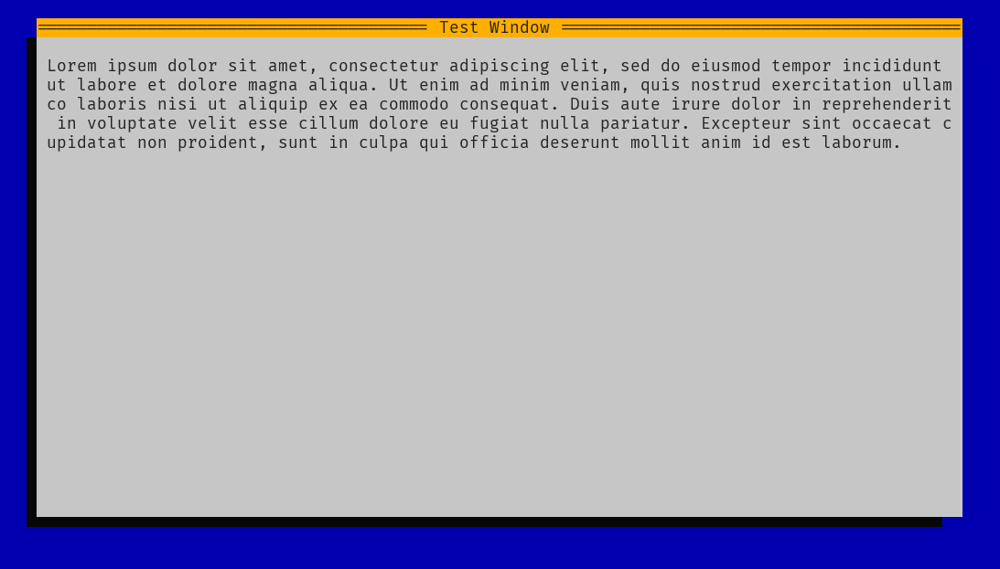

# C-TUI
#### By Max Russell

A small TUI library written in C. WIP, missing most features at the moment. Implemented:
- Window with shadow and titlebar
- Automatically wrap text to window size

Screenshot:
